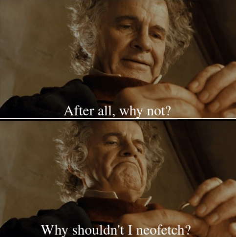
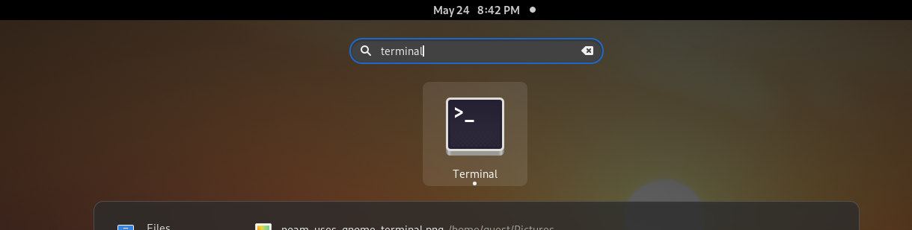

 ## Favorite `memes` -> `There is no place like 127.0.0.1` (Your Local machine)


## Description
	**Before we get into security stuff we have to talk a little bit about the basics of web development. A very fast introduction to HTML, CSS and JavaScript.**

 ### You will work in your local machine
 
 
 
# Open your __Terminal__



For your information __Vi/Vim__ is a editor use in a shell (`https://www.vim.org`) <-- offical website 
Or if you want install Vim in your terminal use this line command (`sudo apt install vim`)
Only vim commands line for install is given gere because vi is by default install in your __terminal__

### Vim Info

`press "i" for edit and press "Esc" ":wq" for save and quit` 

## Shell Operations


	cd /tmp
	vim test.html
	
	
```html
		<!Doctype html> 
		<html>
			<head></head>
			<body>
				<h1>LiveOverflow</h1>
				<p>Lorem ipsum dolor sit amet, consecteur adispiscing elit</p>
				
			<p>
				<a href ="http://liveoverflow.com">LiveOverflow Website <a>
				<form>
				<input type="text">
				<input type="submit" value="submit form ">
				</form>
				
			</p>		
			</body>		
		 </html > 
```
		
* firefox test.html OR google-chrome test.html Or you can open this file with other browser
		 
+ After this you can see the page , you should do right click et click in a "inspector"
		 for see page source code and search eventual problems or bugs.
		 
### Section
		 In the first tab presented you can see the html document elements ,from ther you can modify web page (html)
		 
## Adding Css

```html 
		 <!Doctype html> 
		<html>
		<style>
			p{
				color: #ff0000;
			}
			input.form_elemnt{
				font-size: 2em;
			}
			#heading{
				border: 1px solid #000000;
				margin: 10px;
			}
		
		
		</style>
			<head></head>
			<body>
				<h1 id ="heading">LiveOverflow</h1>
				<p>Lorem ipsum dolor sit amet, consecteur adispiscing elit</p>
				
			<p>
				<a href ="http://liveoverflow.com">LiveOverflow Website <a>
				<form>
				<input form ="form_element" type="text">
				<input form="formm_element"  type="submit" value="submit form ">
				</form>				
			</p>		
			</body>		
		 </html>
```		 
**If you an modify the css content without touch your file , tou can see the "Style tab " in Tab Elements  here you can modify and see automaticaly result**
		 
## Adding Js
```javascript		 
			 
		 <!Doctype html> 
		<html>
		<style>
			p{
				color: #ff0000;
			}
			input.form_elemnt{
				font-size: 2em;
			}
			#heading{
				border: 1px solid #000000;
				margin: 10px;
			}
		
		
		</style>
		<script>
			function useless(){
				alert(1);
			}

		</script>		

	<--! <script src="myscript.js" > </script> (others options) -->
		
		
	<--!<link rel ="stylesheet" type="text/css" href="mystyle.css"> (mystlyle.css must be on local , in your local machine, it's others options)-->
			<head></head>
			<body>
				<h1 id ="heading"  onclick="useless "   >LiveOverflow</h1>
				<p>Lorem ipsum dolor sit amet, consecteur adispiscing elit</p>
				
			<p>
				<a   onclick="useless(1)"  href ="https://liveoverflow.com">LiveOverflow Website <a>
				<form>
				<input form ="form_element" type="text">
				<input onclick="alert(1)" form="formm_element"  type="submit" value="submit form ">
				</form>
				
			</p>		
			</body>		
		 </html>
```

__When you inspect your page going to "Console" tab ,you can execute javascript(Js) code__ 

>useless (your function)
>document.body.children(display your body code)
>document.body.children[1] (display second element of Tab because the first element is 0)
>document.body.children[1].innerText="test!!!" (for change eleme nt who is a [1]'th in the tab by "test!!!")		 	 

## Finish
**By KOUHOUENOU Ted R.**		 
